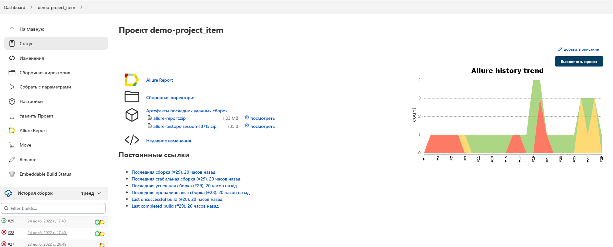
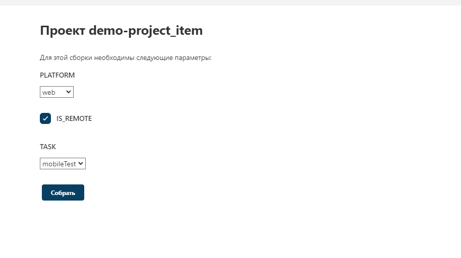
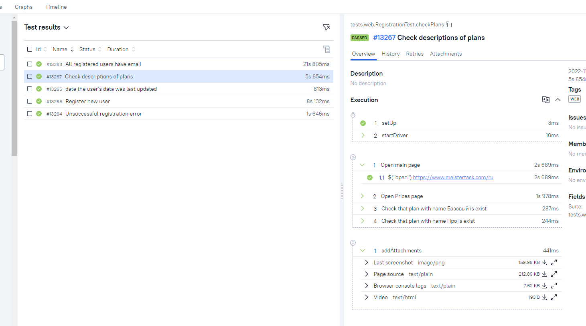
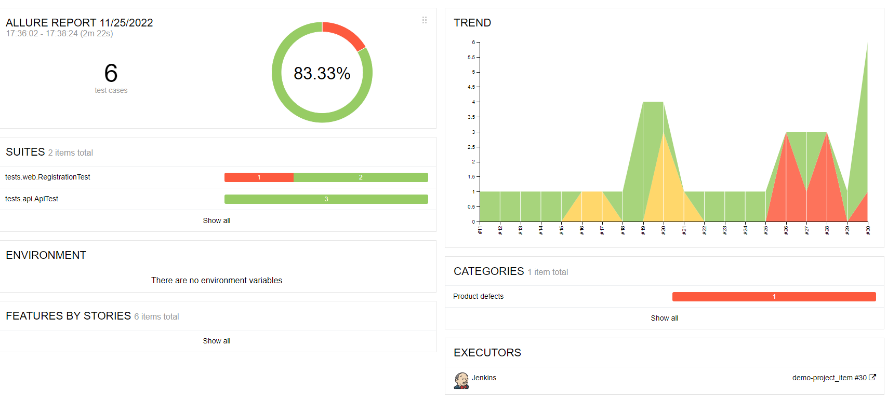
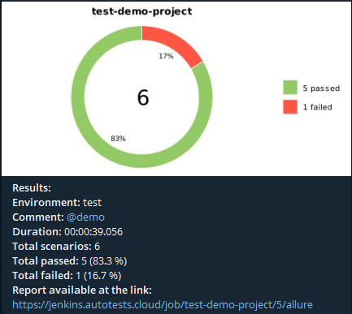

# Test automation demo-project

## <a name="TableOfContents">Table of contents</a>
+ [Description](#Description)
+ [Tools and technologies](#Technology)
+ [How to run](#Jenkins)
    + [Gradle command](#GradleCommand)
    + [Run in Jenkins](#RunInJenkins)
+ [Telegram Notifications](#TelegramNotifications)
+ [Test results report in Allure Report](#AllureReport)
+ [Allure TestOps integration](#AllureTestOps)
    + [Project in Allure TestOps](#AllureTestOpsProject)
    + [Start a run of custom set of tests](#AllureTestOpsStartTests)
    + [Dashboards](#Dashboards)
    + [Defects](#Defects)
+ [Video of running tests](#Video)


# <a name="Description">Description</a>
The test project consists of Web, API and mobile(android) tests.\
A brief list of interesting facts about the project:
- [x] `Page Object` with steps using `Chain of Invocations`
- [x] Fake data generating with `Faker` library
- [x] Parametrized build
- [x] Different configuration files for test running depending on build parameters
- [x] Config with `Owner` library
- [x] Using `Lombok` for models for API tests
- [x] Objects serialization/deserialization for API requests/responses using `Jackson`
- [x] Using request/response specifications for API tests
- [x] Custom Allure listener for beautiful API requests/responses logging
- [x] `Allure TestOps` integration


# <a name="Technology">Tools and a technologies</a>
<p  align="center">
  <code></code>
  <code></code>
  <code></code>
  <code></code>
  <code></code>
  <code></code>
  <code></code>
  <code></code>
  <code></code>
  <code></code>
  <code></code>
  <code></code>
  <code></code>
</p>

The autotests in this project are written in `Java` using `Selenide` framework.\
`Gradle` - is used as a build automation tool.  \
`JUnit5` - to execute tests.\
`REST Assured` - for easy API testing of REST services.\
`Jenkins` - CI/CD for running tests remotely.\
`Selenoid` - to remote launching browsers in `Docker` containers.\
`Browserstack` - to run mobile tests.\
`Android Studio tools`, `Appium` - to tun mobile tests locally in a mobile device emulator.\
`Allure Report` - for test results visualisation.\
`Telegram Bot` - for test results notifications.\
`Allure TestOps` - as Test Management System.

[Back to the table of contents ⬆](#TableOfContents)

# <a name="HowToRun">How to run</a>

## <a name="GradleCommand"> Launch from the terminal</a>

To start local test run use the following commands

for web tests:
```bash
gradle clean webTest -Dplatform=<plaform> -DisRemote=<false>
```
for mobile tests:

```bash
gradle clean mobileTest -Dplatform=<plaform> -DisRemote=<false>
```
To start remote test run use the same command with parameter 

```bash
-DisRemote=<true>
```

### Parameters:

`platfrom` - defines a browser for running tests:
>- *Web*
>- *Mobile*
 
`isRemote` - defines the test run is local or remote


[Back to the table of contents ⬆](#TableOfContents)

## <a name="RunInJenkins">Run in [Jenkins](https://jenkins.autotests.cloud/job/demo-project_item/)</a>
Main page of the build:
<p  align="center">

</p>

A parametrized Jenkins job can be launched with needed ***platform***, ***isRemote*** and ***task***:
<p  align="center">

</p>


After the build is done the test results are available in:
>- <code><strong>*Allure Report*</strong></code>
>- <code><strong>*Allure TestOps*</strong></code> - results are uploaded there and the automated test-cases can be automatically updated accordingly to the recent changes in the code.

<p  align="center">

</p>

<p  align="center">

</p>

[Back to the table of contents ⬆](#TableOfContents)


# <a name="TelegramNotifications">Telegram Notifications</a>
Telegram bot sends a brief report to a specified telegram chat by results of each build.

<p  align="center">

</p>

[Back to the table of contents ⬆](#TableOfContents)


# <a name="Video">Video of running tests</a>


https://selenoid.autotests.cloud/video/b83f2eac5a5dd807ec65093bda0751b4.mp4

[Back to the table of contents ⬆](#TableOfContents)
